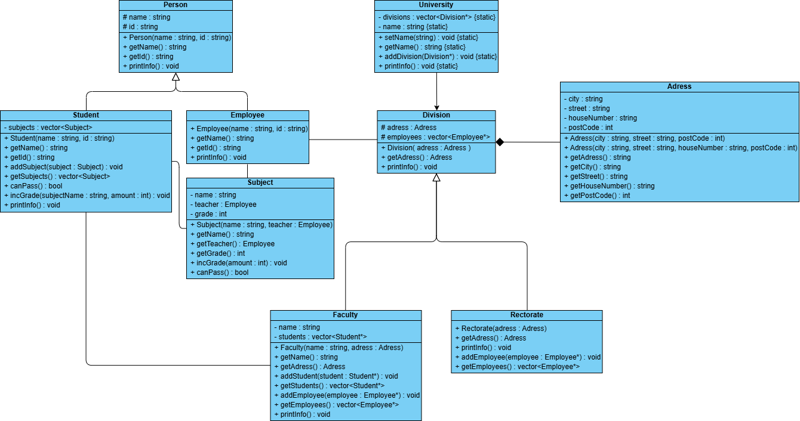

# University Simulator (VŠB)

## What is this?
This is a small C++ project that models how a university is organized. It handles the different parts of a school—like the main offices (Rectorate) and the different departments (Faculties)—and keeps track of the people inside them.

I wrote this to practice the basics of Object-Oriented Programming. It manages students, teachers, and their grades, and it can automatically tell you if a student is passing their classes or not.

---

## Project Design
Below is the class diagram showing how all the parts of the system connect:

---

## How it works
The project is built using a few simple building blocks:

* **The University**: This is the main "container" that holds all the different branches of the school.
* **Divisions (Faculties & Rectorate)**: These represent the different buildings or departments. A **Faculty** holds students and teachers, while the **Rectorate** is for the administrative staff.
* **People (Students & Employees)**: Everyone has a name and an ID number.
    * **Students** have a list of subjects they are taking.
    * **Employees** act as the teachers for those subjects.
* **Subjects**: These link a teacher to a specific class. Each subject stores a student's grade and knows if that grade is high enough to pass.
* **Address**: A simple way to store where each department is located (City, Street, etc.).

---

## What can it do?
* **Handle different addresses**: You can create an address with just a street name or add a specific house number if you have it.
* **Track Grades**: When you give a student a grade in a subject, the system updates their record.
* **Check Passing Status**: The student can check all their subjects and tell you if they are passing overall.
* **Print Reports**: There is a `printInfo()` command that prints a nice, readable summary of everything happening in a department—who works there, who studies there, and how they are doing.

---

## How to run it
I’ve included a `Makefile` to make compiling easy.

1.  Open your terminal in the project folder.
2.  Type `make`.
3.  The program will compile all the files and automatically run the demo (`res.out`).